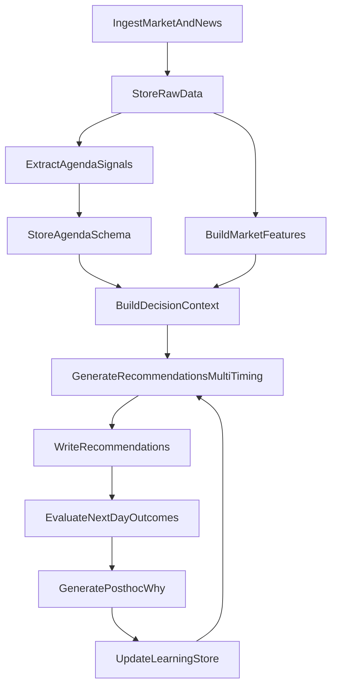

# Finance agent: multi-universe + learning loop

## Goals (v1)

- **Multiple tradable universes** (sets of instruments) stored in a dedicated `finance` Postgres schema, scoped to org/user but **restricted to org slug `finance`**.
- **Two parallel schemas of inputs**:
  - **Traditional market/metrics**: prices + derived features.
  - **Agenda/manipulation**: extracted narrative objects with confidence + citations.
- **Multi-timing recommendations**: each daily run can emit multiple "what would you do" records (pre-close, post-close, pre-open, intraday), without requiring us to pick a single timing upfront.
- **Learning loop**: store success/failure + next-day outcome + post-hoc explanation, and feed those back into the next run.

## Key design choices (aligned to your notes)

- **No auto-trading yet**: the agent only writes **recommendation records** (buy/sell/hold + time window + intended price/entry method + rationale).
- **Versioned + active** for universes/feature sets/models so you can A/B and audit.
- **Finance-only gating**:
  - RLS and API checks require `org_slug = 'finance'`.
  - Access controlled via existing RBAC membership (`public.rbac_user_org_roles`) pattern used by other domain schemas (see [`20251229200001_create_engineering_schema.sql`](apps/api/supabase/migrations/20251229200001_create_engineering_schema.sql)).

## Data model (new `finance` schema)

Create a migration that follows the repo's domain-schema pattern (schemas like `engineering`, `orch_flow`, `code_ops` already exist).

### Universe configuration
- `finance.universes` (id, org_slug, slug, name, description, created_by, created_at, updated_at)
- `finance.universe_versions` (id, universe_id, version, is_active, config_json, created_at)
  - `config_json` holds instruments list, market hours/timezone, allowed timing windows, data-source profile refs.

### Raw market data + features
- `finance.market_bars` (id, instrument, ts, open, high, low, close, volume, vendor, ingestion_metadata, created_at)
- `finance.market_features` (id, universe_version_id, asof_ts, instrument, feature_set_version_id, features_json, created_at)

### News/world events (license-safe)
- `finance.news_items` (id, source, published_at, url, title, snippet, vendor_ids, retrieval_metadata, created_at)
- Optional `finance.news_fulltext` only if/when license allows; otherwise keep references.

### Agenda/manipulation schema (LLM extracted)
- `finance.agenda_events` (id, asof_ts, source_refs[], narrative, suspected_incentive, target_instruments[], confidence, evidence_json, created_at)
- `finance.agenda_features` (id, universe_version_id, asof_ts, instrument, agenda_features_json, created_at)

### Recommendations + evaluation + learning
- `finance.recommendation_runs` (id, universe_version_id, run_ts, produced_by_agent, inputs_hash, status, created_at)
- `finance.recommendations` (id, run_id, instrument, action, timing_window, entry_style, intended_price, sizing_json, rationale, model_metadata, created_at)
- `finance.recommendation_outcomes` (id, recommendation_id, realized_return_metrics_json, win_loss, evaluation_notes, evaluated_at, created_at)
- `finance.postmortems` (id, recommendation_id, what_happened, why_it_happened, links_to_agenda_events[], lessons, created_at)

### Required schema infrastructure
- **RLS policies**: All tables gated to `org_slug = 'finance'` using helper function
- **Service role bypass**: `USING (true)` policies for service role on all tables
- **Updated_at triggers**: Auto-update `updated_at` on universes table
- **Indexes**: On foreign keys, timestamps, and frequently queried columns

## Execution flow

## API + agent integration (NestJS)

- **Frontend → A2A**: frontend builds the ExecutionContext capsule and POSTs to `POST /agent-to-agent/:orgSlug/:agentSlug/tasks`, which validates context and creates task records before execution (see `apps/api/src/agent2agent/agent2agent.controller.ts`).
- **Agent execution path**: implement finance as an **`api` agent** whose `transport.api.endpoint` targets a **LangGraph app endpoint**. This matches Marketing Swarm's pattern.
- **API runner → LangGraph**: the backend `ApiAgentRunnerService` forwards `context` + `userMessage` (and enriches provider/model for interpolation) when calling API agents (see `apps/api/src/agent2agent/services/api-agent-runner.service.ts`).
- **LangGraph endpoint**: implement the finance workflow inside `apps/langgraph` as a new agent module/controller (like `apps/langgraph/src/agents/marketing-swarm/marketing-swarm.controller.ts`) that requires `request.context` and uses `context.taskId` as the primary thread/task key.
- Keep a small API module under `apps/api/src/finance/` for **CRUD + viewing** (universes, recommendation runs, outcomes) and to enforce org slug `finance` + RBAC.
- Insert a new `public.agents` record for org `finance` via a new incremental migration (do **not** modify baseline; follow `apps/api/supabase/migrations/GOLD_STANDARD_README.md`).

## Frontend: dedicated conversation pane (like Marketing Swarm)

- The web app renders a dedicated pane when the agent metadata includes `hasCustomUI` and `customUIComponent` (see `apps/web/src/components/ConversationView.vue`).
- For finance, we'll add a new custom UI component (e.g., `FinanceTab.vue`) and render it in `ConversationView.vue` when `customUIComponent === 'finance'`.
- The finance agent record in `public.agents.metadata` will include `hasCustomUI: true` and `customUIComponent: 'finance'` so selection by agent slug triggers the correct pane (same mechanism used for Marketing Swarm and CAD).

## Multi-timing support (your "run all three, then decide")

- Each run generates a bundle of recommendations across timing windows (e.g., `pre_close`, `post_close`, `pre_open`, `intraday_now`).
- Store them as separate rows with consistent IDs so you can compare:
  - same instrument, same run, different timing_window/entry_style.
- Evaluation computes outcomes for each window using the appropriate realized price series.

## News source feasibility (Bloomberg and others)

- Build connectors to support **historical day queries** where licensing permits.
- For v1 (hybrid), implement:
  - Open-source ingestion (RSS/GDELT/etc.)
  - Yahoo Finance or Alpha Vantage for market data (free tier)
  - A "licensed connector interface" that can later be wired to Bloomberg/Refinitiv without schema changes.

## Deliverables (what you'll see daily)

- A list of **recommendation records** per universe version:
  - instrument, buy/sell/hold
  - when to place (timing_window)
  - intended price/entry style
  - sizing + risk notes
  - rationale (market + agenda schema fused)
- Next day: outcomes + postmortems + updated learning context.

## Validation / demo testing

- Use the existing Supabase test auth patterns (repo standard) to call the finance agent endpoint and finance API endpoints.
- Test user in `finance` org with `finance:admin` permission for admin UI testing.

## Admin UI: Finance Universes (inside AdminSettings)

- Add a new AdminSettings "Data & Access" item (same layout as RAG in `apps/web/src/views/AdminSettingsPage.vue`).
- Gate with RBAC permission `finance:admin` using the existing `v-permission` directive (`apps/web/src/directives/permission.ts`).
- The detail view should support: list universes, create universe, create new version, set active version, and manage instrument lists + timing variants.
- Backend endpoints for this admin UI are provided by the `apps/api/src/finance/` module and should be protected with `@RequirePermission('finance:admin')` + `RbacGuard`.

## Reference implementations

| Component | Reference File |
|-----------|---------------|
| Domain schema | [`20251229200001_create_engineering_schema.sql`](apps/api/supabase/migrations/20251229200001_create_engineering_schema.sql) |
| Org creation | [`20260105000002_create_legal_org.sql`](apps/api/supabase/migrations/20260105000002_create_legal_org.sql) |
| Agent registration | [`20251229200006_register_cad_agent.sql`](apps/api/supabase/migrations/20251229200006_register_cad_agent.sql) |
| LangGraph module | [`marketing-swarm.module.ts`](apps/langgraph/src/agents/marketing-swarm/marketing-swarm.module.ts) |
| Admin UI page | [`RagCollectionsPage.vue`](apps/web/src/views/admin/RagCollectionsPage.vue) |
| Frontend service | [`ragService.ts`](apps/web/src/services/ragService.ts) |
| Frontend store | [`ragStore.ts`](apps/web/src/stores/ragStore.ts) |
