# A2A Agent Service Hierarchy

This document illustrates the hierarchical structure of the Agent-to-Agent (A2A) framework, showing how base services inherit from each other and how actual agent implementations extend these base services.

## Architecture Overview

The A2A framework follows a layered architecture where:
- **A2AAgentBaseService** serves as the root base class providing core A2A functionality
- **Specialized Base Services** extend the root to provide specific capabilities for different agent types
- **Actual Agent Implementations** extend the specialized base services to implement specific business logic

## Class Hierarchy Diagram

```mermaid
graph TD
    %% Root Base Service
    A2A[A2AAgentBaseService<br/>Core A2A Functionality<br/>• Task Management<br/>• JSON-RPC Protocol<br/>• Agent Registration<br/>• Status Monitoring]
    
    %% Specialized Base Services
    Context[ContextAgentBaseService<br/>Context-Based Agents<br/>• System Prompt Processing<br/>• Context File Integration<br/>• Simple LLM Interactions]
    
    TSFunction[FunctionAgentBaseService<br/>TypeScript Function Agents<br/>• Custom TypeScript Logic<br/>• Complex Workflows<br/>• Advanced Integrations]
    
    PyFunction[PythonFunctionAgentBaseService<br/>Python Function Agents<br/>• Python Script Execution<br/>• Data Processing<br/>• ML/AI Operations]
    
    API[ApiAgentBaseService<br/>API-Based Agents<br/>• External API Integration<br/>• RESTful Operations<br/>• Third-party Services]
    
    External[ExternalA2AAgentBaseService<br/>External A2A Agents<br/>• Remote Agent Communication<br/>• Distributed Systems<br/>• Cross-platform Integration]
    
    %% Direct inheritors from A2A Base
    Orchestrator[OrchestratorAgentService<br/>Meta-Agent Coordination<br/>• Intent Recognition<br/>• Multi-agent Orchestration<br/>• Context Preservation]
    
    %% Context-based agents
    SOP[SopAgentService<br/>Standard Operating Procedures]
    Content[ContentAgentService<br/>Content Creation & Strategy]
    Voice[VoiceSummaryAgentService<br/>Audio Processing & Summaries]
    Calendar[CalendarAgentService<br/>Scheduling & Coordination]
    Email[EmailTriageAgentService<br/>Email Management]
    Onboarding[OnboardingAgentService<br/>Employee Integration]
    BlogPost[BlogPostAgentService<br/>Blog Content Generation]
    Competitors[CompetitorsAgentService<br/>Competitive Intelligence]
    MarketResearch[MarketResearchAgentService<br/>Market Analysis]
    Invoice[InvoiceAgentService<br/>Financial Operations]
    Launcher[LauncherAgentService<br/>System Deployment]
    
    %% TypeScript function-based agents
    Metrics[MetricsAgentService<br/>Performance Analytics]
    HR[HRAssistantService<br/>Human Resources]
    Marketing[MarketingSwarmService<br/>Marketing Automation]
    
    %% Python function-based agents
    Requirements[RequirementsWriterService<br/>Technical Documentation]
    
    %% API-based agents
    Golf[RulesOfGolfAgentService<br/>Golf Rules & Regulations]
    
    %% External agents
    Hiverarchy[HiverarchyAgentService<br/>External Service Integration]
    
    %% Inheritance relationships
    A2A --> Context
    A2A --> TSFunction
    A2A --> PyFunction
    A2A --> API
    A2A --> External
    A2A --> Orchestrator
    
    %% Context-based implementations
    Context --> SOP
    Context --> Content
    Context --> Voice
    Context --> Calendar
    Context --> Email
    Context --> Onboarding
    Context --> BlogPost
    Context --> Competitors
    Context --> MarketResearch
    Context --> Invoice
    Context --> Launcher
    
    %% TypeScript function implementations
    TSFunction --> Metrics
    TSFunction --> HR
    TSFunction --> Marketing
    
    %% Python function implementations
    PyFunction --> Requirements
    
    %% API implementations
    API --> Golf
    
    %% External implementations
    External --> Hiverarchy
    
    %% Styling
    classDef rootClass fill:#ff6b6b,stroke:#d63031,stroke-width:3px,color:#fff
    classDef baseClass fill:#4ecdc4,stroke:#00b894,stroke-width:2px,color:#fff
    classDef contextClass fill:#a8e6cf,stroke:#00b894,stroke-width:1px
    classDef functionClass fill:#ffd93d,stroke:#fdcb6e,stroke-width:1px
    classDef pythonClass fill:#6c5ce7,stroke:#a29bfe,stroke-width:1px,color:#fff
    classDef apiClass fill:#fd79a8,stroke:#e84393,stroke-width:1px,color:#fff
    classDef externalClass fill:#74b9ff,stroke:#0984e3,stroke-width:1px,color:#fff
    classDef orchestratorClass fill:#e17055,stroke:#d63031,stroke-width:2px,color:#fff
    
    class A2A rootClass
    class Context,TSFunction,PyFunction,API,External baseClass
    class SOP,Content,Voice,Calendar,Email,Onboarding,BlogPost,Competitors,MarketResearch,Invoice,Launcher contextClass
    class Metrics,HR,Marketing functionClass
    class Requirements pythonClass
    class Golf apiClass
    class Hiverarchy externalClass
    class Orchestrator orchestratorClass
```

## Base Service Descriptions

### A2AAgentBaseService (Root)
The foundation of all agents in the system, providing:
- **Task Lifecycle Management**: Creation, execution, status tracking
- **JSON-RPC Protocol**: Standardized communication interface
- **Agent Registration**: Discovery and metadata management
- **Status Monitoring**: Real-time progress tracking via WebSockets
- **Authentication & Authorization**: Secure access control
- **Logging & Monitoring**: Comprehensive observability

### Specialized Base Services

#### ContextAgentBaseService
For agents defined primarily by system prompts and context files:
- **Context File Processing**: Loads and manages agent-context.md files
- **Simple LLM Integration**: Direct prompt-to-response workflows
- **Minimal Code Requirements**: No custom logic needed
- **Rapid Development**: Quick agent creation through configuration

#### FunctionAgentBaseService (TypeScript)
For agents requiring custom TypeScript business logic:
- **Custom Function Execution**: agent-function.ts file processing
- **Advanced Workflows**: Complex multi-step processes
- **TypeScript Integration**: Full access to Node.js ecosystem
- **Service Dependencies**: Integration with other NestJS services

#### PythonFunctionAgentBaseService
For agents requiring Python-based processing:
- **Python Script Execution**: agent-function.py file processing
- **Data Science Integration**: NumPy, Pandas, ML libraries
- **Process Management**: Isolated Python subprocess execution
- **Bidirectional Communication**: TypeScript ↔ Python data exchange

#### ApiAgentBaseService
For agents that primarily interact with external APIs:
- **HTTP Client Integration**: Built-in REST API capabilities
- **Authentication Management**: OAuth, API keys, tokens
- **Rate Limiting**: Automatic throttling and retry logic
- **Response Transformation**: Data mapping and validation

#### ExternalA2AAgentBaseService
For integration with remote A2A-compliant agents:
- **Remote Communication**: Cross-network agent interaction
- **Protocol Translation**: A2A standard compliance
- **Distributed Coordination**: Multi-system orchestration
- **Fault Tolerance**: Network failure handling

## Agent Implementation Examples

### Context Agents
Simple agents that process user inputs using LLMs and predefined context:
- **SOP Agent**: Standard operating procedure documentation
- **Content Agent**: Marketing content creation and strategy
- **Email Triage Agent**: Intelligent email categorization and prioritization

### Function Agents (TypeScript)
Complex agents with custom business logic:
- **Metrics Agent**: Performance analytics and KPI calculation
- **HR Assistant**: Employee management and HR processes
- **Marketing Swarm**: Coordinated marketing campaign automation

### Function Agents (Python)
Agents leveraging Python's data processing capabilities:
- **Requirements Writer**: Technical documentation generation
- **Data Analysis Agents**: Statistical processing and ML inference

### API Agents
Agents that interface with external services:
- **Golf Rules Agent**: Integration with golf regulations database
- **CRM Integration Agents**: Third-party service connectivity

### External Agents
Agents that coordinate with remote A2A systems:
- **Hiverarchy Agent**: External service orchestration
- **Partner System Integration**: Cross-organizational workflows

### Special Case: Orchestrator
The **OrchestratorAgentService** directly inherits from **A2AAgentBaseService** as it serves as a meta-agent responsible for:
- **Intent Recognition**: Understanding user requests and routing appropriately
- **Multi-Agent Coordination**: Managing complex workflows across multiple agents
- **Context Preservation**: Maintaining conversation state across agent handoffs
- **Fallback Handling**: Direct response when no specific agent is needed

## Development Guidelines

### Choosing the Right Base Service

1. **Use ContextAgentBaseService when**:
   - Agent behavior can be defined through prompts and context
   - No custom code logic is required
   - Rapid prototyping is needed

2. **Use FunctionAgentBaseService when**:
   - Custom TypeScript business logic is required
   - Integration with other NestJS services is needed
   - Complex workflows must be implemented

3. **Use PythonFunctionAgentBaseService when**:
   - Data processing or ML capabilities are required
   - Python libraries are essential
   - Scientific computing is involved

4. **Use ApiAgentBaseService when**:
   - Primary function is external API integration
   - RESTful operations are the main capability
   - Third-party service coordination is needed

5. **Use ExternalA2AAgentBaseService when**:
   - Integrating with remote A2A systems
   - Cross-platform coordination is required
   - Distributed agent workflows are needed

### Implementation Requirements

Each agent implementation must:
- Extend the appropriate base service
- Implement the `getAgentName()` method
- Provide proper dependency injection in the constructor
- Include an `agent.yaml` configuration file
- Have appropriate context documentation (context.md or agent-context.md)

This hierarchy ensures consistent behavior, maintainable code, and scalable agent development across the entire A2A ecosystem. 